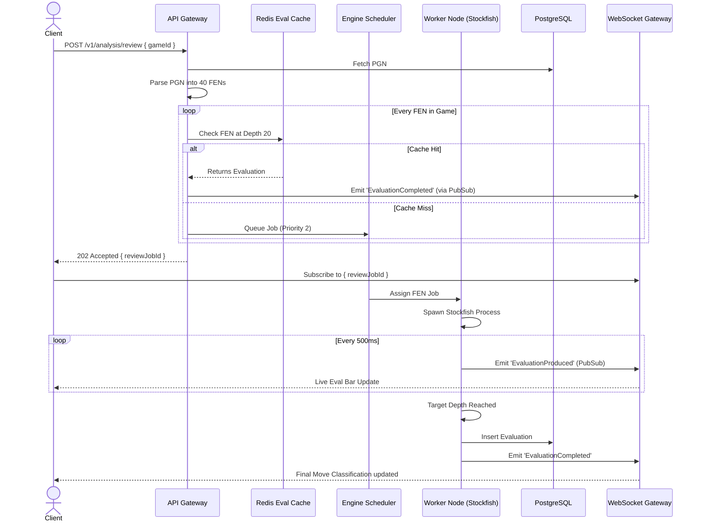
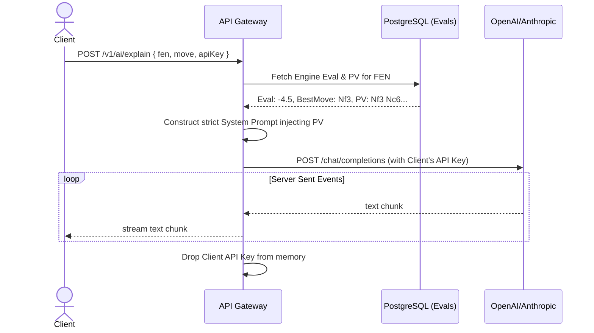
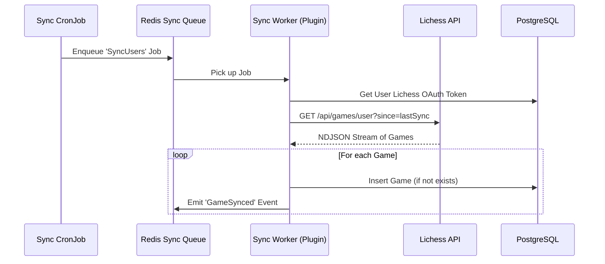

# Chessome: Sequence Diagrams

This document visualizes the core critical paths of the platform using Mermaid.js.

## 1. Cloud Game Review Request
This diagram illustrates the flow when a user requests a full game review, demonstrating the interaction between the API, Scheduler, Cache, and Workers.

## 2. Bring Your Own Key (BYOK) AI Explanation
This diagram shows how the system prevents the LLM from hallucinating by forcing it to read the Engine's PV (Principal Variation).

## 3. Automated OAuth Game Sync
How Chessome stays up to date with a user's Lichess account seamlessly in the background.

